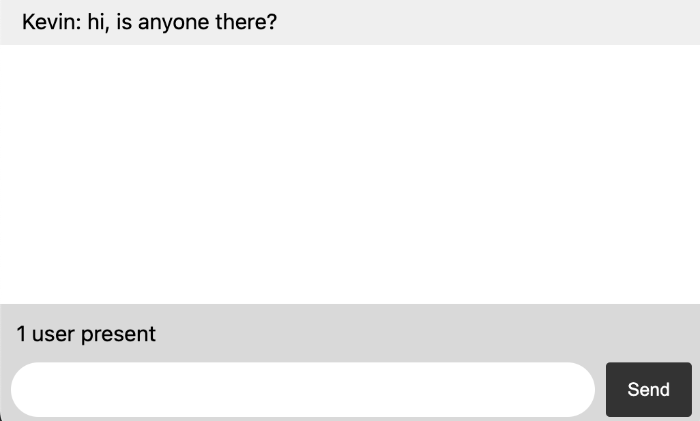

# Chat
Web chat implemented with websockets.



## Installation and use
To install and use, you need [Node](https://nodejs.org/en).

From there, navigate to the project's root directory and run:
```bash
npm install
```

To use:
```bash
npm run start
```

This will start an Express server at http://localhost:3000. You can visit this URL in multiple tabs to test out the chat functionality.

# Technical details
I followed the tutorial at https://socket.io, which got me most of the way there. The app runs as an Express server which serves a HTML index file at `http://localhost:3000`. Socket.io mounts onto this server, sending and receiving messages between the client. The client code is written in HTML, CSS, and JS.

## Future improvements
- Allow users to pick colors for their chat messages/display names
- Images
- Direct messages/whispers
