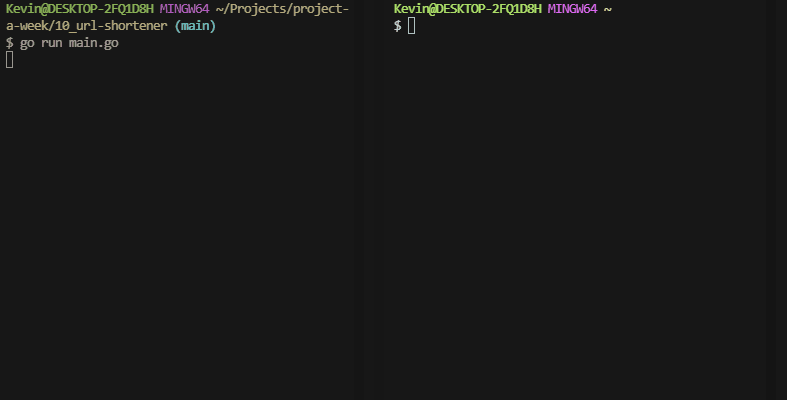

# Link shortener
Go server that allows you to shorten URLs and assign names to them.



## Installation and use
Go is requried for this project! To start the server:
```bash
go run main.go
```

To create a shortened link, send a `POST` request to `localhost:8000/createLink` with the following JSON payload that has the vlaues `link` and `shortName`. For example:
```bash
curl -d '{"link":"https://github.com", "shortName":"github"}' -H "Content-Type: application/json" -X POST localhost:8000/createLink
```

# Technical details
I've been wanting to learn Go for a while and I've seen this project done elsewhere so I figured, "Why not?" It's a very different experience from JavaScript and Python, but one that I appreciate nonetheless.

The map of shortened links to original links is stored in-memory to keep things simple. Theoretically it wouldn't be too bad to get this persisted to a local sqlite db, but for now this is fine.

## Future improvements
- If the user doesn't provide a `shortName` value, generate one
- Authorization for editing and deleting links you created
- Persist link data to a database
